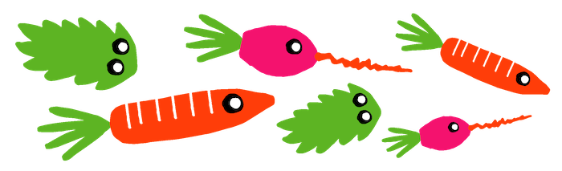
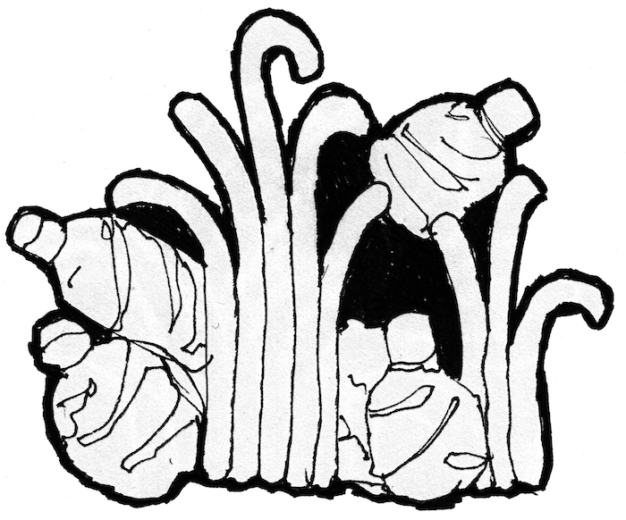
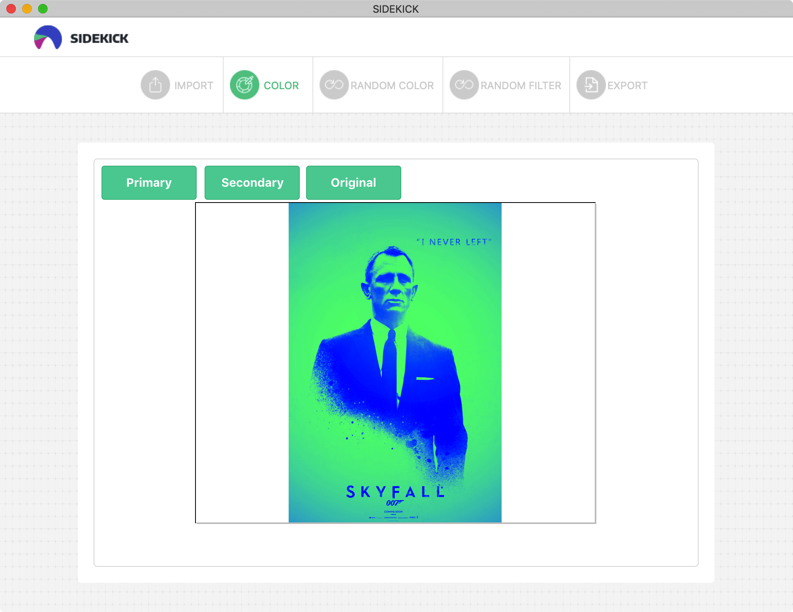
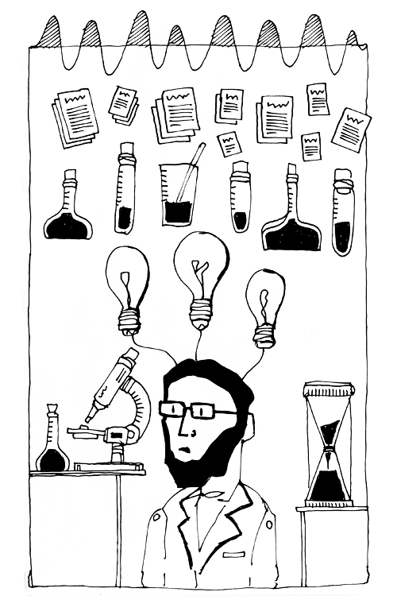

Curriculum Vitae
 

[Download CV](content/cv/cv.pdf)

Jasper van BloklandMA

Designer
Educator
Programmer

	

I am driven to simplify content into clear and understandable images

© 2018

The Netherlands
Breda
06 245 27 440

Expertise

- 
[Motion Design](#motion)

- 
[Conditional Design](#conditional)
 
- 
[Illustration](#illustration)

- 
[Graphic Design](#graphic)

### 
Soft Skills

- 
Team-player

- 
Communicator

- 
Enthusiastic entrepreneur

- 
Problem solver

- 
Brainstormer

Technical skills

- 
Python
 
- 
Processing
 
- 
HTML
 
- 
CSS3

- 
SASS

- 
Markdown
 
- 
Adobe

- 
Sketch

<a name="illustration"/>

Conditional illustration

Illustrations
Conditions
Repetition
Black & White
Fineliner
Skylines

These drawings are made with repetitions of visual conditions

<a name="motion"/>

Conditional animation
Avans University of Applied Science

Master Animation
Illustrations
Conditions
Efficient
Typography
Movement
Collaboration

Poster & conditional generated visuals

<video src="content/animation/mov/4.mov" no-controls loop autoplay></video>

The research in Parametric Animation explores the role of animation and movement in the (graphic) design process. Generated by Parametric Animation, the outcomes are variations of a design which uses principles of animation and movement, intended for Graphic Designers.

Conditional generated animations

<video class="animation" src="content/animation/mov/5.mp4" type="video/mp4" no-controls loop autoplay></video>
<video class="animation" src="content/animation/mov/6.mp4" type="video/mp4" no-controls loop autoplay></video>
<video class="animation" src="content/animation/mov/7.mp4" type="video/mp4" no-controls loop autoplay></video>
<video class="animation" src="content/animation/mov/8.mp4" type="video/mp4" no-controls loop autoplay></video>
<video class="animation" src="content/animation/mov/9.mp4" type="video/mp4" no-controls loop autoplay></video>

Several parties were involved in this research. Testing and discussing the use of parametric animation with them made a great contribution to the research, which resulted in an application that will generate different designs based on formulated conditions.

<!---

Conditional Animated Layout Models

-->

Process illustrations

 

 
 

<a name="graphic"/>

Microplastic
Avans University of Applied Science

Bachelor Graphic Design
Identity
Infographic
Collaboration Ocean Cleanup

Exposition Bachelor Graduation

Graduation exposition AKV Sint Joost Breda - The Netherlands - 2016 June

For the Graduation Bachelor Graphic Design I made an infographic about the plastic sea pollution, based on data and research by the Ocean Cleanup Rapport 2014

Pictogram illustrations

Maquette experiments

Process illustrations

<a name="conditional"/>

Conditional design

Bachelor Graphic Design

Generated conditional posters

Generated outcomes with a conditional layout

Over the years I've developed two applications – one generates colour variations, while the other creates alternative designs based on the design that you provide. Although these two applications are different, the similarity is that both generate lots of divergent results within a short period of time.

Side Kick Color Application

Screenshots of the color application; the application generates a divergent of color variations

Each design process contains a production process, characterized by repetitive actions. By automating this part of the design process, the designer gets more time to focus on designing rather than producing.

Conditional portrait illustrations

 
 
 
 

Conditional portraits with different types of line weight

<a name="graphic"/>

Way-finding icons
Avans University of Applied Science

Illustration
Identity
WayFinding Delft

Map experiments

Pictogram illustrations

Stereotype Scientists
Illustrations for IntroScience NL

Co-Founder Introscience NL
Identity

Chaotic selfportraits
Avans University of Applied Science

Illustration
Self-portrait

Ornaments

Illustration
Experiments
Shading

Croatia

Holiday
Notation

Responsive web educator
Royal Academy of Art The Hague

Education & Achievement

|||||
|---|---|---|---|
|2016 - 2018|Conditional Animation|Master|AKV St Joost - Avans University of Applied Science|
|2013 - 2016|Generative Design|Bachelor|AKV St Joost - Avans University of Applied Science|
|2011 - 2012|Graphic Design|Propedeuse|Royal Academy of Art The Hague|
|2003 - 2011|School for Young Talent|High School|Royal Academy of Art The Hague|
|2016 - 2017|Training in entrepreneurship|Certificate|Starterslift|
|2016 - 2017|Support in entrepreneurship|Business Support|Business Atelier|

Master thesis: "Conditional Animation - Designing with animation makes the design process a lot easier and more efficient"

© 2018 Jasper van Blokland
Font: Upgrade © TYPETR

